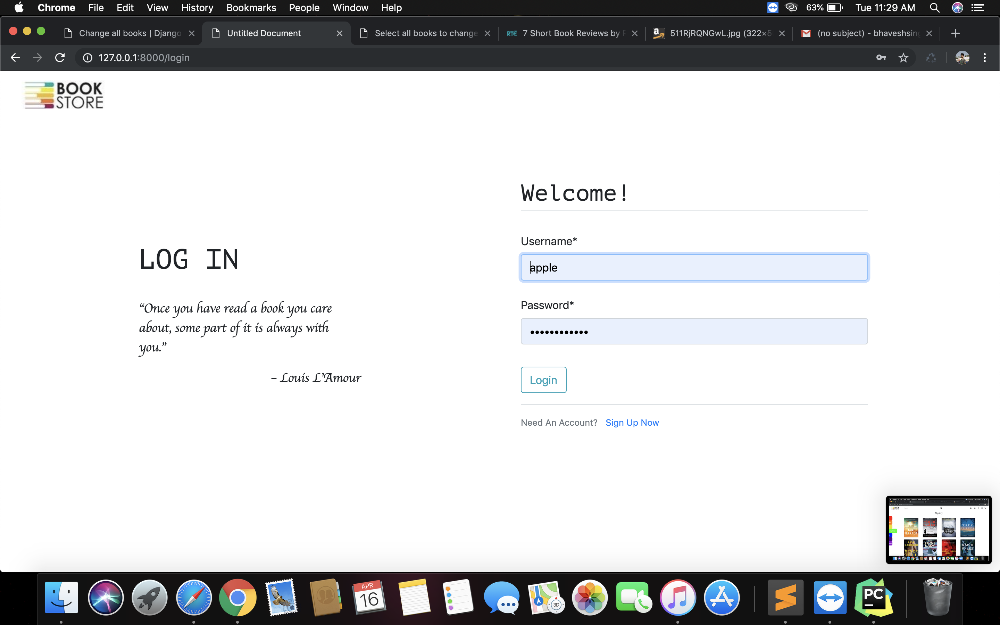

# Ebook Store

### About

Ebook Store is an application where readers can spend time reading quality books. It offers a variety of books which are divided into different genres. Readers can provide ratings and their opinions after reading a book. A recommendation system has also been used which recommends new books to the reader based on his earlier reads and how much he liked the novel. 

## Flow and Feature

- A reader has to login to the system to start reading
- Select the genre which he/she wants to read
- Reader can favourite or rate the novel, after which Machine learning algorithm will provide recommendations to the reader.
- Can even download a soft-copy of the novel if he wishes to read offline.
- The Application has an easy-to-use and a beautiful design to provide user with a better user friendly experience.
- Inorder to increase the number of books and create a reading environment, readers are also allowed to add books to the database.

### Technology Stack

- Web Frontend developed using Html/css and Vanilla JavaScript

- Backend developed using Django

- Database - MySql

## Screenshots

### Login/Registration

### Dashbaord

## MIT LICENSE

> Copyright (c) 2018 Bhavesh Singh
>
> Permission is hereby granted, free of charge, to any person obtaining a copy
> of this software and associated documentation files (the "Software"), to deal
> in the Software without restriction, including without limitation the rights
> to use, copy, modify, merge, publish, distribute, sublicense, and/or sell
> copies of the Software, and to permit persons to whom the Software is
> furnished to do so, subject to the following conditions:
>
> The above copyright notice and this permission notice shall be included in all
> copies or substantial portions of the Software.
>
> THE SOFTWARE IS PROVIDED "AS IS", WITHOUT WARRANTY OF ANY KIND, EXPRESS OR
> IMPLIED, INCLUDING BUT NOT LIMITED TO THE WARRANTIES OF MERCHANTABILITY,
> FITNESS FOR A PARTICULAR PURPOSE AND NONINFRINGEMENT. IN NO EVENT SHALL THE
> AUTHORS OR COPYRIGHT HOLDERS BE LIABLE FOR ANY CLAIM, DAMAGES OR OTHER
> LIABILITY, WHETHER IN AN ACTION OF CONTRACT, TORT OR OTHERWISE, ARISING FROM,
> OUT OF OR IN CONNECTION WITH THE SOFTWARE OR THE USE OR OTHER DEALINGS IN THE
> SOFTWARE.
